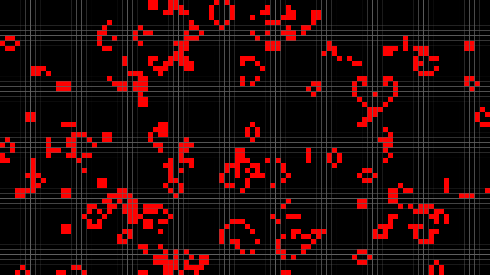

# Game Of Life
This is my simple game of life written in C++ using the SDL2 library.

## Controls

* LMB: make the cell alive
* RMB: make the cell dead
* C: set delay to default
* Mouse Wheel Up, +: increase delay
* Mouse Wheel Down, -: decrease delay
* P: pause the game
* X: close the game

## Screenshots

